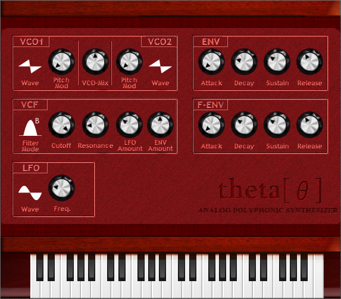

# ThetaSynth

## About

A simple software synthesizer developed with C++, using framework "[WDL-OL/IPlug](https://github.com/olilarkin/wdl-ol)".

This repository is a result of my personal interest and was created following articles found on [Making Audio Plugins - Martin Finke's Blog](https://www.martin-finke.de/tags/making_audio_plugins.html).

## GUI Components

You can find and view the exported PNG files of the metallic knob [here](gui_knob).

Please note that the images may appear slightly jagged as they aren't the original versions.

A `.knob` file requires [KnobMan/JKnobMan](https://www.g200kg.com/jp/software/knobman.html).

## Knowledge

This software requires a variety of knowledge, including:

- Audio plugin framework: [WDL-OL/IPlug](https://github.com/olilarkin/wdl-ol)
- Finite state machine (for ADSR envelope generator)
- Fourier transform (for generating waveforms)
- Observer pattern using `<functional>` (C++ Technical Report 1)
- Realtime monitoring of MIDI signals using [pbhogan/Signals](https://github.com/pbhogan/Signals)

## License

This repository contains only C++ source code and GUI components.

The C++ source code provided here is derived from [the tutorial](https://www.martin-finke.de/tags/making_audio_plugins.html), and its use is subject to the conditions set by the author.

Meanwhile, all the GUI components were created by me and are licensed under [the MIT license](LICENSE).
